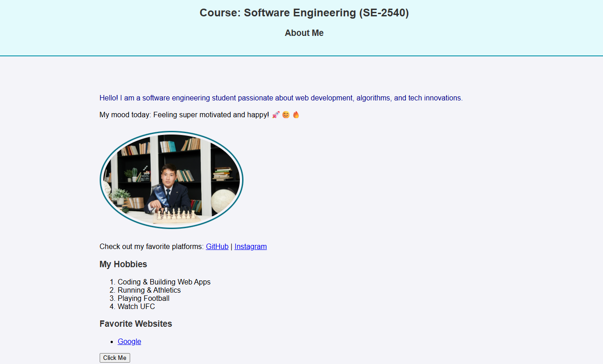
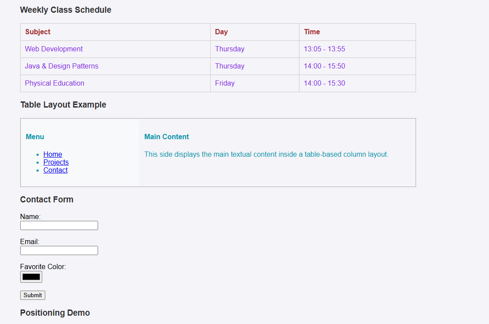
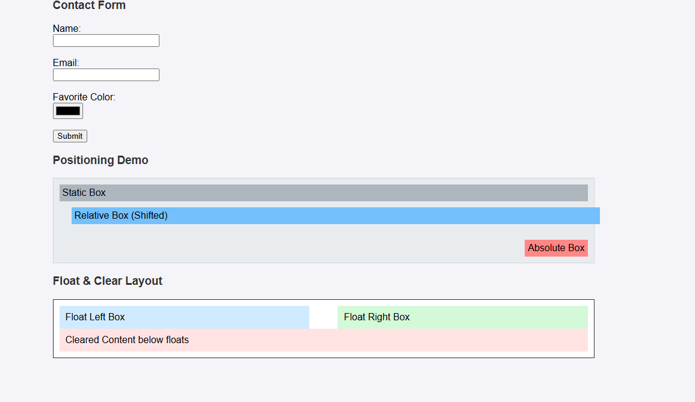

# Web Development Practice: HTML & CSS Basics

**Author:** Nurkhan Karashev
**Group:** SE-2540

---

## 1. Objective
The primary objective of this assignment is to demonstrate foundational skills in web development using HTML5 and CSS3. This includes structuring personal information, handling tables and form inputs, applying various CSS styling techniques (inline, internal, external, Box Model, positioning), and publishing the working repository to GitHub Pages.

---

## 2. Steps Taken

### Part 1 & 2: HTML Fundamentals & Layout Structure
* **Step 0–1:** Created `index.html` with standard HTML5 boilerplate, page title "My First Webpage", and structural headings (`<h1>` to `<h3>`) displaying personal and academic details.
* **Step 2–4:** Added an ordered list (`<ol>`) for personal hobbies, an unordered list (`<ul>`) for links, a profile image (``), and a basic interactive button (`<button>`).
* **Step 5–6:** Constructed the weekly schedule table with headers (`Subject`, `Day`, `Time`) and implemented a two-column layout table separating the navigation menu from the main content.
* **Step 7–8:** Integrated emojis into text blocks and built a contact form containing `text`, `email`, and `color` input fields with a submit button.

### Part 3 & 4: CSS Styling & Responsive Design
* **Step 9–12:** Connected an external stylesheet (`style.css`), internal `<style>` rules within `<head>`, and inline `style=""` attributes to test CSS priority.
* **Step 13–14:** Used element selectors, class selectors (`.highlight`, `.schedule-table`), and an ID selector (`#main-heading`) to apply distinct colors and typography.
* **Step 15–17:** Linked `favicon.png`, structured content using semantic `
` elements (`header-section`, `main-content`, `footer-section`), and applied Box Model properties (`margin`, `padding`, `border`, `border-radius`).
* **Step 18–20:** Implemented CSS positioning (`static`, `relative`, `absolute`), various measurement units (`px`, `%`, `em`, `rem`), and container layout controls using `float` and `clear`.

---

## 3. Webpage Screenshots

*(Replace file paths below with your actual screenshot images in the repository)*

* **Header & Main Overview:**  
  

* **Class Schedule Table & Contact Form:**  
  
  
---

## 4. Final Reflection
Building this project provided clear, practical experience in organizing structured content with HTML and applying custom styles with CSS. Configuring table layouts and testing different CSS positioning models gave a solid understanding of how elements behave on a webpage. Furthermore, managing code versions and publishing through GitHub Pages provided essential real-world deployment experience.